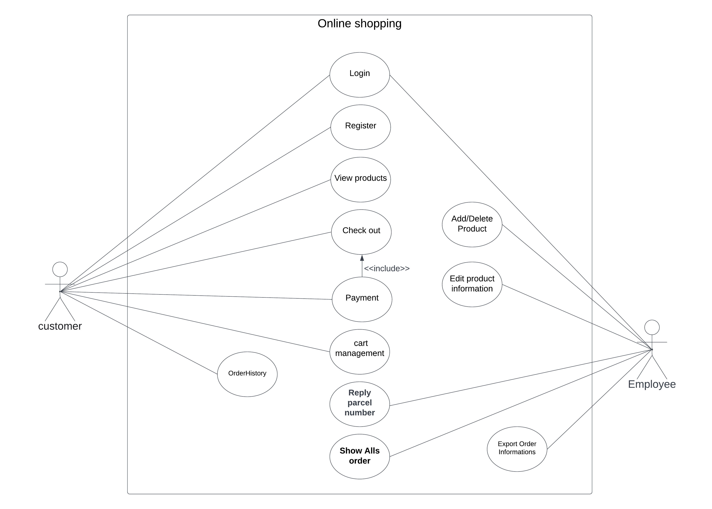

# Achi-WebAppProject
> Achi เป็นโครงงานวิชา Web-Programming ของเรานักษาชั้นปีที่ 2 คณะเทคโนโลยีสารสนเทศ สาขาเทคโนโลยีสารสนเทศ แขนง software engineering โดยศึกษาการเขียนโปรแกรมบนเว็บไซต์โดยใช้ภาษา 
> javascript และ fram work มาช่วยในการพัฒนา เช่น Vue.js และ Node.js
## พัฒนาโดย
*  1.) นายวิชัย คำมงคุณ รหัสนักศึกษา 64070230 
*  2.) นายอนพัทย์ นันทนพิบูล รหัสนักศึกษา 64070249
## พัฒนาโดยใช้
* HTML/CSS
* Node JS / Express **(Back-End)**
* Vue.js **(Front-End)**
* Mysql / aws cloud **(Databases)**
* Omise PaymentGateway
## บทนำ
> อีคอมเมิร์ช เป็นการทำธุรกิจรูปแบบใหม่ที่กำลังได้รับความนิยมในปัจจุบัน และ ปฏิเสธไม่ได้ว่าอินเตอร์เน็ตได้กลายเป็นส่วนหนึ่งในชีวิตประจำวันของผู้คนในปัจจุบันไปแล้วคนไทยใช้อินเตอร์เน็ตกันมากกว่าวันละ 8 ชั่วโมงต่อวัน ทำให้หลาย ๆ ธุรกิจหันมาทำ E-commerce เพื่อขยายช่องทางเข้าถึงกลุ่มเป้าหมายและเพิ่มโอกาสเติบโตธุรกิจให้มากขึ้น สำหรับการทำธุรกิจขายรองเท้ากีฬารูปแบบเดิม ลูกค้าต้องมาเลือกสิ้นค้าเองที่ร้านและไม่สามารถรู้ว่าวันนี้มีสินค้าชิ้นไหนกำลังวางขายอยู่หรือสินค้าชิ้นไหนถูกขายหมดแล้ว และ ไม่สามารถขายสิ้นค้าได้ตลอดเวลาซึ่งอาจทำให้เสียโอกาสในการขายสินค้า เว็บไซต์ขายรองเท้ากีฬาออนใลน์สามารถนำมาใช้แก้ปัญหาที่กล่าวมาและช่วยบันทึกข้อมูลการซื้อขายและช่วยจัดการคำสั่งซื้อได้ทันที
## ขอบเขตของปัญหา
* ลูกค้าต้องมาดูสิ้นค้าเองที่ร้านเท่านั้น
* ไม่สามารถขายสินค้าได้ตลอดเวลา ทำให้ลดโอากาสขายสินค้า
* ลูกค้าไม่สามารถรู้ว่ามีสินค้าชิ้นไหนกำลังวางขายอยู่ อาจทำให้ลูกค้ามาแล้วเสียเวลา
* ไม่มีระบบจัดการคำสั่งซื้อ และบันทึกข้อมูล

## แผนภาพการทำงาน
### Use-Case Daigram
 
### ER-Daigram
 .png)
